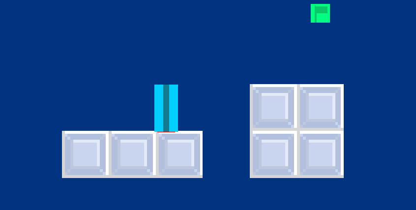

# PlatformerGL
</img>
## Purpose:
The purpose of this project was to create a simple prototype for a platformer, my first real test 
to see if I can implement some game mechanics such as levels, basic physics, entities, entity managers,
custom level formats, cameras, and various other things into a game rendered using OpenGL. In short, it's
my first real test of abstracting away the OGL and integrating game logic along with it. Due to this, expect
to find some confusing code. It certainly taught me many lessons, which I will carry onto future projects.
## Demonstration:
</img>
## Controls:
- Left: A
- Right: D
- Jump:  Space
- View Quads: T
- Zoom out: X
- Zoom in: Z
