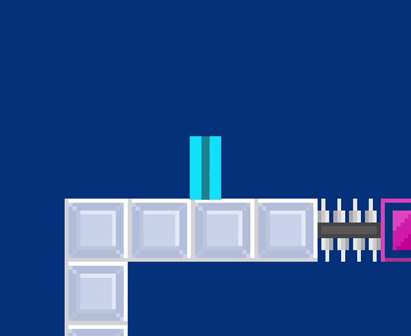

# PlatformerGL
</img>
## Purpose:
The purpose of this project was to create a simple prototype for a platformer, my first real test 
to see if I can implement some game mechanics such as levels, basic physics, entities, entity managers,
custom level formats, cameras, and various other things into a game rendered using OpenGL. In short, it's
my first real test of abstracting away the OGL and integrating game logic along with it. Due to this, expect
to find some confusing code. It certainly taught me many lessons, which I will carry onto future projects.
## Demonstration:
</img>
## Notes:
Please note that the game has no text, so there isn't a score or level counter. If you beat the game, the game simply terminates. 
I added text in my following project, SpaceSHUMPGL, since I had a batch renderer for that one. I'm going to work on 
a 2D text library for OpenGL so I can easily add text into my programs going forward, perhaps this one will get a slught revamp
when that happens.
## Usage:
To demo the product, download the repository as a zip and navigate to the "pgl-exe.zip" file. Unzip it, then within it, run the pgl.jar file.
## Controls:
- Left: A
- Right: D
- Jump:  Space
- View Quads: T
- Zoom out: X
- Zoom in: Z
